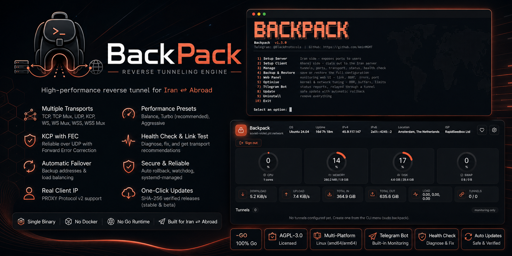
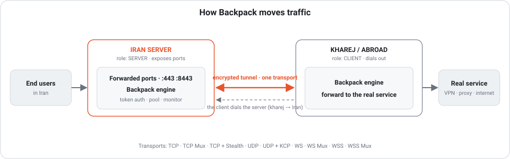
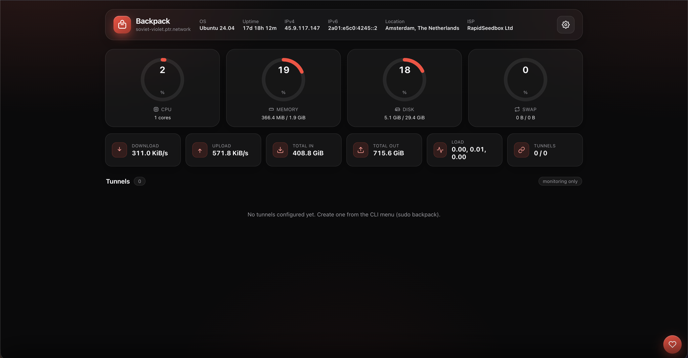

<div dir="rtl">

<p align="center"></p>

# بک‌پک 🎒

<p align="center">
  <a href="go.mod"></a>
  <a href="https://github.com/AminMGMT/BackPack/releases/latest"></a>
  <a href="LICENSE"></a>
  <a href="https://github.com/AminMGMT/BackPack/stargazers"></a>
  <a href="https://github.com/AminMGMT/BackPack/releases"></a>
</p>

**بک‌پک** یک هستهٔ تونل با کارایی بالاست که کاملاً با **Go** نوشته شده و برای
ست‌آپ سرور ایران ⇄ خارج طراحی شده. یک باینری واحد است با یک منوی تعاملی CLI
**و** یک پنل وب امن — یعنی همه‌چیز را با ترمینال یا بدون ترمینال می‌توانی
مدیریت کنی.

تونل را به دو شکل می‌برد: **معکوس** (خارج به ایران وصل می‌شود) و **مستقیم**
(ایران به خارج وصل می‌شود و یک تونل کامل IP می‌سازد).

</div>

<p align="center">
  <b><a href="tutorial/README.md">📘 آموزش‌های راه‌اندازی</a></b> ·
  <b><a href="docs/README.md">📚 مستندات</a></b> ·
  <b><a href="README.md">🇬🇧 English</a></b> ·
  <b><a href="https://t.me/BlackProtocols">✈️ تلگرام</a></b>
</p>

<div dir="rtl">

> هر صفحهٔ `docs/` و `tutorial/` در انتها یک **خلاصهٔ فارسی** دارد.

---

## چطور کار می‌کند

<p align="center"></p>

</div>

```
  کاربر ──▶  سرور ایران  ══ تونل ══▶  سرور خارج  ──▶  سرویس واقعی
             «Setup Iran»              «Setup Kharej»    (X-UI، پنل،
             پورت‌ها را باز می‌کند       به ایران وصل می‌شود   وایرگارد…)
```

<div dir="rtl">

کاربر به یک **پورت forward‌شده** روی سرور ایران وصل می‌شود؛ انجین آن را از طریق
**یک ترنسپورت** به کلاینت خارج می‌برد و کلاینت آن را به **سرویس واقعی** می‌رساند.
در تونل **معکوس** بالا، خودِ تونل **توسط کلاینت** برقرار می‌شود (خارج → ایران)،
پس سمت خارج نیازی به پورت ورودی باز ندارد.

### دو شکل تونل

**پورت‌ها هیچ‌وقت جابه‌جا نمی‌شوند.** ایران همیشه آن‌ها را باز می‌کند و خارج
همیشه سرویس واقعی را دارد. چیزی که انتخاب می‌کنی این است که *کدام طرف اول دست
دراز می‌کند*، و *چه چیزی بینشان سفر می‌کند*:

| | کی وصل می‌شود | چه چیزی می‌برد | کِی این را بردار |
|---|---|---|---|
| **[معکوس](#تونل-معکوس--۱۲-ترنسپورت)** | خارج → ایران | پورت‌های forward‌شده | حالت معمول: ایران می‌تواند اتصال ورودی بپذیرد |
| **[مستقیم](#تونل-مستقیم--۶-حامل)** | ایران → خارج | یک شبکهٔ خصوصی، با پورت‌های forward‌شده رویش | وقتی اتصال ورودی به ایران رد نمی‌شود |

هر دو یک‌جور ساخته می‌شوند — `sudo backpack` را اجرا کن، برای ماشینی که رویش
هستی **Setup Iran** یا **Setup Kharej** را بردار، و بقیه را ویزارد می‌پرسد.

---

## تونل معکوس — ۱۲ ترنسپورت

خارج به ایران وصل می‌شود، پس **ایران یک پورت باز لازم دارد** و خارج هیچ پورتی
لازم ندارد. ترنسپورتی را بردار که با مسیر تو بخواند؛ اگر مطمئن نیستی
**Manage → Link Test** مسیر واقعی‌ات را می‌سنجد و پیشنهاد می‌دهد.

| ترنسپورت | در یک خط چیست | نیاز دارد به | راهنما |
|---|---|---|---|
| **TCP** | یک اتصال TCP ساده برای هر جریان. وقتی چیزی فیلتر نیست، نقطهٔ شروع همین است. | — | [→](tutorial/tcp.md) |
| **TCP Mux** | همان، با چند جریان روی چند اتصال مشترک. برای سرویسی که اتصال‌های کوتاه و زیاد باز می‌کند. | — | [→](tutorial/tcp-mux.md) |
| **TCP + Stealth** | همان TCP با یک لایهٔ رکورد Noise رویش — **شبیه بایت تصادفی، بدون هیچ fingerprint**. | — | [→](tutorial/tcp-stealth.md) |
| **TCP + PCK** | سگمنت‌های TCP که بدون سوکت ساخته می‌شوند: نه handshake کرنل، نه state اتصال. برای مسیری که TCP وصل می‌شود و بعد می‌میرد، ریست می‌خورد یا throttle می‌شود. | لینوکس، root | [→](tutorial/tcp-pck.md) |
| **UDP** | دیتاگرام خام UDP. کمترین سربار، بدون بازیابی. | UDP باز | [→](tutorial/udp.md) |
| **UDP + KCP + FEC** | UDP با تصحیح خطا که به‌جای منتظرماندن برای retransmit، افت را ترمیم می‌کند. **جواب بازی و مسیر پرافت.** | UDP باز | [→](tutorial/udp-kcp-fec.md) |
| **UDP + QUIC** | یک سشن واقعی QUIC: TLS 1.3، کنترل ازدحام خودش، بدون چیزی برای تنظیم. | UDP باز | [→](tutorial/udp-quic.md) |
| **WS** | وب‌سوکت روی HTTP ساده. برای مسیری که فقط HTTP رد می‌شود. | — | [→](tutorial/websocket.md) |
| **WS Mux** | همان، مالتی‌پلکس‌شده. | — | [→](tutorial/websocket.md) |
| **WSS** | وب‌سوکت داخل TLS، با handshake واقعی **کروم**، و جواب هر کاوشگر یک **سایت تقلبی**. دقیقاً شبیه یک سایت HTTPS معمولی و از CDN رد می‌شود. | گواهی | [→](tutorial/websocket-tls.md) |
| **WSS Mux** | همان، مالتی‌پلکس‌شده. | گواهی | [→](tutorial/websocket-tls.md) |
| **xDi (ICMP)** | تونل داخل پکت‌های پینگ، برای مسیری که TCP و UDP را می‌بندد ولی ICMP را نه. | لینوکس، root، ICMP باز | [→](tutorial/xdi-icmp.md) |

**[← مقایسهٔ هر دوازده‌تا، تنظیم به تنظیم](docs/transports.md)** ·
**[← کدام را بردارم؟](docs/choosing-a-transport.md)** ·
**[← وقتی سروری فیلتر یا کثیف است](docs/filtered-or-dirty-ip.md)**

> روی **TCP، TCP Mux، UDP، WS و WS Mux** توکن همان‌طور که هست روی سیم می‌رود.
> روی مسیر نامطمئن یکی از رمزنگاری‌شده‌ها را بردار — Stealth، PCK، KCP، QUIC، WSS.

---

## تونل مستقیم — ۶ حامل

ایران **بیرون** زنگ می‌زند، پس **هیچ پورت ورودی روی ایران لازم نیست**. این یکی
یک تونل کامل IP است: روی هر هاست یک اینترفیس که پکت کامل IP حمل می‌کند، پس دو
سرور یک شبکهٔ خصوصی مشترک دارند و هر چیزی می‌تواند رویش route شود — و پورت‌های
forward هم دقیقاً مثل تونل معکوس رویش کار می‌کنند.

هر تونل مستقیم **GRE + Noise** است: رمزنگاری‌شده، احراز هویت دوطرفه، با پنجرهٔ
replay، و **MTU خودش را اندازه می‌گیرد**. تنها چیزی که انتخاب می‌کنی، حاملی است
که این بسته‌بندی داخلش سفر می‌کند.

| حامل | روی سیم شبیه چیست | نیاز دارد به | راهنما |
|---|---|---|---|
| **udp** | دیتاگرام معمولی UDP. پیش‌فرض، و سریع‌ترین. | UDP باز | [→](docs/l3-direct-tunnel.md) |
| **quic** | یک سشن واقعی QUIC که تونل را در دیتاگرام‌های RFC 9221 حمل می‌کند. | UDP باز | [→](docs/l3-direct-tunnel.md) |
| **pck** | سگمنت‌های TCP که زیر کرنل ساخته می‌شوند — نه handshake، نه state. جواب وقتی UDP throttle می‌شود. | لینوکس، root | [→](docs/tcp-pck.md) |
| **sni** | همان `pck`، با یک TLS hello که یک دامنهٔ مجاز را ابتدای جریان اعلام می‌کند. | لینوکس، root | [→](docs/l3-direct-tunnel.md) |
| **xdi** | ICMP echo، برای مسیری که UDP و TCP را می‌بندد ولی پینگ را نه. | لینوکس، root، ICMP باز | [→](docs/l3-direct-tunnel.md) |
| **spoof** | IP خام با **آدرس مبدأ جعلی**، برای مسیری که بر اساس مبدأ محدود یا مسدود می‌کند. | لینوکس، root، مسیری که مبدأ جعلی را رد کند | [→](docs/ip-spoofing.md) |

هر شش‌تا یک‌جور ساخته می‌شوند — `sudo backpack` → **Setup Iran** یا
**Setup Kharej** → **Direct** → حامل را انتخاب کن — و یک صفحه همه‌شان را پوشش
می‌دهد:

**[← تونل مستقیم به‌طور کامل](docs/l3-direct-tunnel.md)** ·
**[← IP Spoofing، تنظیم به تنظیم](docs/ip-spoofing.md)** · [صفحهٔ راه‌اندازی‌اش](tutorial/ip-spoofing.md) ·
**[← توضیح TCP + PCK](docs/tcp-pck.md)** ·
**[← تونل مستقیم لایه‌۴ قدیمی](docs/direct-tunnel.md)** · [صفحهٔ راه‌اندازی‌اش](tutorial/direct-tunnel.md)

---

## نصب

فقط یک دستور با کاربر root روی VPS. آرشیو ریلیز مخصوص معماری سرورت را دانلود
می‌کند، **با چک‌سام منتشرشده تأیید می‌کند**، نصب می‌کند و خودش منو را باز می‌کند:

</div>

```bash
bash <(curl -fsSL https://raw.githubusercontent.com/AminMGMT/BackPack/main/install.sh)
```

<div dir="rtl">

دفعات بعد هر وقت خواستی با `sudo backpack` بازش کن.

> **سرور به اینترنت دسترسی ندارد؟** یک مسیر نصب آفلاین کامل وجود دارد — فقط یک
> آرشیو را کپی کن. build از سورس هم به‌عنوان راه دوم کار می‌کند.
> **← [راهنمای کامل نصب](docs/install.md)**

---

## شروع سریع

**اول نقش‌ها را درست بگیر** — تنها جایی که همه اشتباه می‌کنند همین است:

| سرور | نقش | گزینهٔ منو | چرا |
|------|-----|------------|-----|
| **ایران** | ورودی | **۱. Setup Iran** | پورت‌ها را باز می‌کند؛ کاربر به **آی‌پی ایران** وصل می‌شود. |
| **خارج** | خروجی | **۲. Setup Kharej** | به سرور ایران وصل می‌شود و ترافیک را به سرویس واقعی می‌رساند. |

**همیشه اول سرور ایران را بساز** — کلاینت به آدرس ایران و توکنی که سرور می‌سازد
نیاز دارد.

</div>

```bash
# روی سرور ایران
sudo backpack   →  1. Setup Iran
#   ترنسپورت → پورت تونل → نام → توکن را کپی کن → پورت‌های forward
#   → سؤال UDP → پریست (Turbo) → تمام

# روی سرور خارج
sudo backpack   →  2. Setup Kharej
#   همان ترنسپورت → آی‌پی ایران + همان پورت تونل → نام → همان توکن
#   → همان پریست → تمام
```

<div dir="rtl">

بعد با `Manage → Status` هر دو طرف را ببین، و اگر چیزی درست نبود
`Manage → Health Check` زیر هر مشکل راه‌حلش را می‌نویسد.

**← [قبل از شروع](tutorial/before-you-start.md)** نقش‌ها، توکن، نگاشت پورت‌ها و
فایروال را کامل توضیح می‌دهد. بعد از آن، هر ترنسپورت صفحهٔ قدم‌به‌قدم خودش را دارد.

> روی سرور خارج **X-UI، 3x-ui یا مرزبان** داری؟ رایج‌ترین حالت همین است و چهار
> نکتهٔ مخصوص خودش را دارد — **[← پشت یک پنل](tutorial/behind-a-panel.md)**.

---

## چرا بک‌پک؟

- **UDP روی هر پورت forward شده** — Xray/3x-ui، شدوساکس، وایرگارد، DNS و بازی،
  روی **همهٔ** ترنسپورت‌ها، فقط با یک گزینه.
  [چطور](tutorial/udp-forwarding.md)
- **بدون fingerprint** — Stealth شبیه بایت تصادفی است؛ WSS با handshake واقعی
  **کروم** وصل می‌شود و به هر کاوشگر یک **سایت تقلبی** نشان می‌دهد.
- **UDP در حد بازی** — KCP با FEC همیشه‌روشن افت پکت را ترمیم می‌کند به‌جای اینکه
  منتظر ارسال مجدد بماند، به‌علاوهٔ **فِیل‌اوور چند-خروجی** که با بدتر شدن مسیر،
  ترافیک را روی سالم‌ترین سرور می‌برد.
- **چیزی خراب نمی‌ماند** — آپدیت یا ویرایشی که تونل را از کار بیندازد **خودش
  برمی‌گردد عقب**، و یک واچ‌داگ مستقل تونل افتاده را در حدود ۱ دقیقه بالا می‌آورد.
- **می‌گوید مشکل کجاست** — Health Check زیر هر مشکل راه‌حل می‌نویسد؛ Link Test
  مسیر را می‌سنجد و ترنسپورت و تایمرهایش را پیشنهاد می‌دهد.
- **تلگرام از ایران** — وضعیت و هشدارها از طریق یک تونل بیرون می‌روند؛ خودش تونل
  را انتخاب می‌کند و اگر افتاد سراغ بعدی می‌رود.
- **نصاب آفلاین** — نصب یا آپدیت **بدون هیچ اینترنتی**.

<details>
<summary><b>فهرست کامل امکانات</b></summary>

**عملکرد** — چهار پریست (Balance، **Turbo**، Aggressive و Throughput روی KCP) همهٔ
مقادیر تنظیم را یک‌جا پر می‌کنند؛ **Optimize** تیونینگ کرنل و شبکه را اعمال می‌کند
(BBR + fq، سقف بافرها، لیمیت فایل)؛ **Link Test** تایمرها را از رفت‌وبرگشت واقعی
مسیرت درمی‌آورد.

**پایداری** — فِیل‌اوور خودکار به آدرس‌های پشتیبان، با **امتیازدهی سلامت**
(`rtt + 2×jitter + 20×loss%`) یا لود بالانس روی همه‌شان؛ واچ‌داگ خودترمیم؛ بازگشت
خودکار؛ سرویس‌های systemd که بعد از ریبوت زنده می‌مانند.

**امنیت** — توکن روی ترنسپورت رمزنگاری‌شده هیچ‌وقت لخت فرستاده نمی‌شود (Stealth و
KCP کلید را از آن می‌سازند، WSS آن را به session تی‌ال‌اس گره می‌زند)؛ PROXY
Protocol v2 برای آی‌پی واقعی کاربر؛ سقف اتصال و پهنای باند هر تونل؛ داشبورد
لاگین‌دار؛ دانلودهای تأییدشده با SHA-256 که اگر تأیید نشوند **نصب نمی‌شوند**.

**مدیریت** — CLI تعاملی که کنار هر گزینه توضیحش هست؛ چک آدرس موقع ساخت (CDN جلوی
سرور، رکورد AAAA)؛ اتصال از لبهٔ CDN؛ لاگ JSON؛ ری‌فرش خودکار هر N ساعت؛ و یک
پروکسی SOCKS5/HTTP داخلی تا خروجی تونل خودش backend باشد.

**مانیتورینگ** — داشبورد وب روی پورت ۷۷۷۷ با نمایش زندهٔ CPU/RAM/دیسک/ترافیک و
وضعیت، پینگ و لاگ هر تونل؛ متریک‌ها شامل ارسال مجدد، افت و ترمیم FEC روی KCP که
بین ری‌استارت‌ها حفظ می‌شوند؛ هشدارهای تلگرام با پیام بازگشت به حالت عادی.

**نگه‌داری** — پشتیبان تک‌فایلی از همهٔ تونل‌ها، رمز پنل، تنظیمات تلگرام، گواهی‌های
TLS و زمان‌بندی؛ آپدیت تأییدشده روی کانال stable یا beta.

</details>

---

## مستندات

**از اینجا شروع کن**

| | |
|---|---|
| **[📘 آموزش‌ها](tutorial/README.md)** | قدم‌به‌قدم، برای هر ترنسپورت یک صفحه — با تک‌تک سؤال‌های ویزارد و جوابشان |
| **[📚 فهرست مستندات](docs/README.md)** | مرجع: هر بخش چیست و چه تنظیماتی دارد |
| **[🚑 عیب‌یابی](docs/troubleshooting.md)** | به ترتیبِ اینکه هر علت چند وقت یک‌بار واقعاً جواب است |
| **[🖥 منوی CLI](docs/cli-menu.md)** | تک‌تک گزینه‌های همهٔ منوها، از جمله Fine Tune |

**تونل‌ها و ترنسپورت‌ها**

| | |
|---|---|
| [ترنسپورت‌ها](docs/transports.md) · [کدام را بردارم](docs/choosing-a-transport.md) | مقایسهٔ هر دوازده‌تا، و چطور تصمیم بگیری |
| [تونل مستقیم](docs/l3-direct-tunnel.md) · [مستقیم لایه‌۴](docs/direct-tunnel.md) | تونل کامل IP، و آن قدیمی که پورت forward می‌کرد |
| [نگاشت پورت‌ها](docs/port-mappings.md) · [UDP روی تونل](docs/forwarded-udp.md) | هر شکلی که `ports = [...]` قبول می‌کند؛ و اگر UDP رد نشد |
| [fallback ترنسپورت](docs/transport-fallback.md) · [failover](docs/failover-load-balancing.md) | وقتی حامل بلاک است، و وقتی آدرس بلاک است |
| [استتار](docs/camouflage.md) · [IP Spoofing](docs/ip-spoofing.md) · [TCP + PCK](docs/tcp-pck.md) | سایت تقلبی، مبدأ جعلی، و TCP بدون کرنل |
| [MSS clamp](docs/mss-clamp.md) · [آی‌پی فیلتر یا کثیف](docs/filtered-or-dirty-ip.md) | راه‌حل «وصل است ولی چیزی رد نمی‌شود»، و آدرس بلاک‌شده |

**اجرا و نگه‌داری**

| | |
|---|---|
| [نصب](docs/install.md) · [آپدیت](docs/updates.md) · [بکاپ و ریستور](docs/backup-restore.md) | نصبش، به‌روز نگه‌داشتنش، و برگرداندنش |
| [پنل وب](docs/web-panel.md) · [صفحه‌به‌صفحه](docs/web-panel-screens.md) · [کنترل دسترسی](docs/access-control.md) | داشبورد، هر صفحه‌ای که دارد، و اینکه چه کسی چه کاری می‌تواند بکند |
| [سرورهای مدیریت‌شده](docs/managed-servers.md) · [سرویس مانیتور](docs/monitor-service.md) | ناوگان از یک صفحه، و سرویسی که مراقبش است |
| [ربات تلگرام](docs/telegram-bot.md) · [هشدارها](docs/alerts.md) · [Health Check](docs/health-check.md) | چه چیزی به تو می‌گوید، و کِی |
| [متریک تونل](docs/tunnel-metrics.md) · [فرستادن لاگ](docs/log-schema.md) · [آی‌پی واقعی کاربر](docs/real-client-ip.md) | چه چیزی را می‌سنجد، و چطور از سرور بیرونش بیاوری |
| [محدودیت‌ها](docs/limits.md) · [پریست‌ها](docs/performance-presets.md) · [چیدمان سرور](docs/server-layout.md) | سقف‌ها، تیونینگ، و اینکه هر چیزی روی دیسک کجاست |

**زیر کاپوت**

| | |
|---|---|
| [معماری](docs/architecture.md) · [مرجع کانفیگ](docs/config-reference.md) | از چه ساخته شده، و هر کلیدی که می‌خواند |
| [تصمیم‌های طراحی](docs/design-decisions.md) · [یادداشت‌های کارایی](docs/performance-notes.md) | چه کارهایی را عمداً نمی‌کند، و اندازه‌گیری‌هایی که تمامش کردند |
| [انتشار](docs/releasing.md) · [مشارکت](CONTRIBUTING.md) | چک‌لیست انتشار، و اینکه این کدبیس چطور نوشته می‌شود |

هر صفحه در انتها یک خلاصهٔ فارسی دارد.

---

## اسکرین‌شات‌ها

| منوی CLI | پنل وب |
|----------|--------|
|  |  |

| مدیریت تونل‌ها | ربات تلگرام |
|----------------|-------------|
|  |  |

---

## حمایت و دونیت

اگر بک‌پک برات مفید بود، یه ستاره یا یه دونیت کوچیک خیلی ارزشمنده. 🙏

- کانال تلگرام: **[@BlackProtocols](https://t.me/BlackProtocols)**

</div>

| کوین | آدرس |
|------|------|
| **Tron (TRX)** | `TTzuUAtsEsrLgNpFVLNTyLVJVRRFNWESYc` |
| **USDT (BEP20)** | `0xc112AE9bfF7c59dEcFb34E988A397848D3093E82` |
| **Toncoin (TON)** | `UQD9g40QubAICJ6zPqegtCY7s-joMx2DB8aIqA0xF1aHoCDs` |

<div dir="rtl">

## لایسنس

**کپی‌رایت © ۲۰۲۶ امین محمدی (AminMGMT).**
تحت **GNU Affero General Public License v3.0 (AGPL-3.0)** منتشر شده — فایل
[LICENSE](LICENSE) و [NOTICE](NOTICE).

می‌توانی از آن استفاده کنی، بخوانی‌اش، تغییرش بدهی، بازتوزیعش کنی و رویش
کسب‌وکار بسازی. دو شرط همراهش می‌آید که هر دو را بخش ۷ همان مجوز صریحاً اجازه
می‌دهد و هیچ‌کدام چیزی از آزادی‌هایی که می‌دهد کم نمی‌کند:

- **انتساب را نگه دار.** یک نسخهٔ تغییریافته باید این خط را در NOTICE، در README،
  در خروجی نسخه، و در اعلان‌هایی که پنلش به کاربرانش نشان می‌دهد داشته باشد:

  > Based on BackPack by Amin Mohammadi (AminMGMT)
  > https://github.com/AminMGMT/BackPack

- **از نام خودت استفاده کن.** «BackPack»، نام و لوگو همراه کد لایسنس نشده‌اند —
  یک fork به نام خودش نیاز دارد. گفتن این حقیقت که کارت بر پایهٔ BackPack است یا
  با آن سازگار است همیشه آزاد است. [TRADEMARK.md](TRADEMARK.md) را ببین.

</div>
