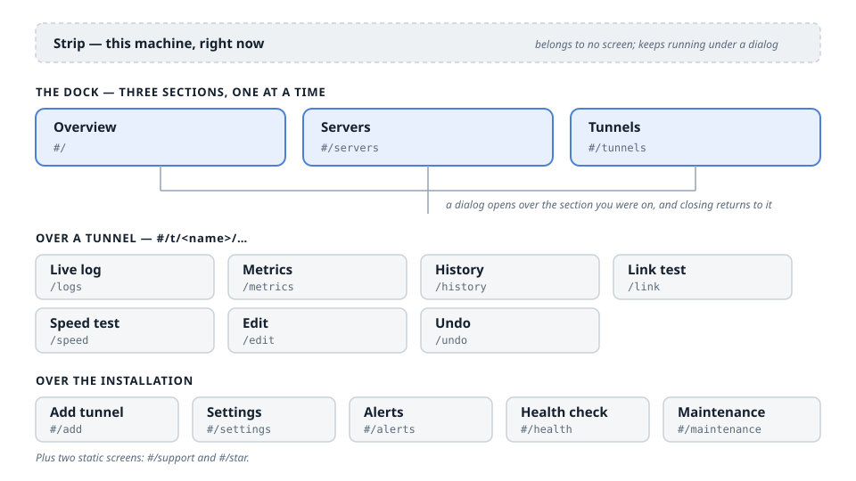

# The web panel, screen by screen

[Web panel](web-panel.md) explains what the panel is and how to turn it on.
This page is the map: every screen it has, how you get there, what it shows, and
which CLI menu entry does the same job. It exists because the panel is the part
of Backpack hardest to describe in prose — there is no command to quote and no
file to show.

## How the panel is shaped

Three things, and it helps to know which is which before reading the list:

**The strip** sits above everything and belongs to no screen. It is this machine
right now: processor, memory, and what is moving this second. It keeps updating
while a dialog is open.

**Three sections**, chosen from the dock: **Overview**, **Servers**,
**Tunnels**. Only these three are pages. Each renders into the same slot, and
switching between them is the only navigation that replaces what you are
looking at.

**Dialogs** — everything else. A dialog opens *over* the section you were on
and closing it puts you back exactly there, so opening Health check from the
Overview does not land you on the Tunnels when you close it.

Every screen has its own URL, and the URL is a hash: `#/t/fr-relay/metrics`.
That is deliberate — the panel is served by a Go mux that knows nothing about
client-side paths, and a hash reloads correctly everywhere. Any screen below can
be bookmarked or linked to.

Addresses in this page are relative to the panel's secret base path, which is
random per installation: the real URL of the Overview is
`https://your-server:7777/<base>/#/`.

## The three sections

### Overview — `#/`

The whole installation on one screen, and the screen the panel opens on.

It repeats nothing from the strip. The strip is now; this is everything that is
not a live meter — what has been carried since the server was set up, which
tunnels carried it, and whatever is currently wrong. Trouble is shown first on
purpose: a page that opens with healthy numbers and hides the one failure among
them is a page that gets glanced at and trusted.

*CLI: the opening screen, plus Manage → Status.*

### Servers — `#/servers`

The managed fleet: other machines this panel can build and run tunnels on.

Adding one is a form. The panel logs into the server over SSH — which is
already running and already how that machine is administered — so there is no
command to carry to the other end and nothing to wait for. See
[managed servers](managed-servers.md).

*CLI: nothing. There is no Backpack state on a managed server to configure.*

### Tunnels — `#/tunnels`

The fleet of tunnels as cards, each with its state, its rate chart, and the
actions for it. This is where start, stop, restart and delete live, and where
every per-tunnel screen below is opened from.

*CLI: Manage → Manage Tunnels.*

## Per-tunnel screens

Each takes the tunnel's name in the URL and opens over whichever section you
were on. `fr-relay` below is an example name.

| Screen | Address | What it is | CLI |
| --- | --- | --- | --- |
| Live log | `#/t/fr-relay/logs` | The tunnel's journald output as it happens, coloured by level. The level is read from the line, because journald hands the panel free text. | Manage → Manage Tunnels → Live Log |
| Metrics | `#/t/fr-relay/metrics` | Everything known about one tunnel: traffic, the peer, limits, the bot relay, the certificate, failover, the connection pool, and on a KCP link what the error correction is repairing. Sections with nothing behind them are removed rather than shown empty. | Manage → Tunnel Metrics |
| History | `#/t/fr-relay/history` | The long view: speed over the last day, per-day totals for the week, both uptime figures, and the configuration changes inside the window. | Manage → Tunnel Metrics |
| Link test | `#/t/fr-relay/link` | Twelve TCP connects to the tunnel port, then the transport the measurement argues for. Same branch logic as the CLI's recommendation, in the same order. | Manage → Link Test |
| Speed test | `#/t/fr-relay/speed` | A throughput measurement through the tunnel itself. | Manage → Speed Test |
| Edit | `#/t/fr-relay/edit` | Every setting the tunnel has. The values come from the same call the CLI's edit screen makes, so a tunnel edited here is byte for byte a tunnel edited in the terminal. | Manage → Manage Tunnels → Edit |
| Undo | `#/t/fr-relay/undo` | The configuration history for this tunnel, and a restore back to any earlier version of it. | Manage → Manage Tunnels → Config history |

## Installation screens

These belong to the machine rather than to one tunnel.

| Screen | Address | What it is | CLI |
| --- | --- | --- | --- |
| Add tunnel | `#/add` | Pick the side, then the transport family, then the transport, then the settings that side actually has. The families and presets are served rather than written into the page, so a transport added to the CLI appears here on its own. | 1 Setup Iran, 2 Setup Kharej |
| Settings | `#/settings` | Panel access, security, the Telegram bot, and the release channel. | 5 Web Panel, 7 Telegram Bot, 8 Update → Release channel |
| Alerts | `#/alerts` | The alert history: what fired, when, and about which tunnel. | The alert history |
| Health check | `#/health` | The machine-level checks — the same list the CLI runs, with the same fixes offered. Reached from the warning bar as well as directly. | Manage → Health Check |
| Maintenance | `#/maintenance` | Update, restore points and backup: the machine-level chores. | 4 Backup & Restore, 8 Update |
| Support | `#/support` | Static. Addresses copy on click. | — |
| Enjoying Backpack? | `#/star` | Static. | — |

## Keeping this page honest

`internal/webui/panelroutes_test.go` reads the routes out of
`panel/js/main.js` and the addresses out of this file, and fails when they
disagree. A screen added to the panel without a line here, or a line here for a
screen that no longer exists, is a failing test rather than a page that quietly
goes wrong.

Screenshots are deliberately not part of this page. A photograph of a panel goes
stale on the next restyle and nothing detects it, whereas the map above is
checked on every build. [The README](../README.md) carries one picture of the
panel for people deciding whether they want it; this page is for people using
it.

---

## خلاصهٔ فارسی

[Web panel](web-panel.md) می‌گوید پنل چیست و چطور روشنش کنی؛ این صفحه **نقشه**
است: هر صفحه‌ای که پنل دارد، چطور به آن می‌رسی، چه نشان می‌دهد، و کدام گزینهٔ CLI
همان کار را می‌کند. وجود دارد چون پنل سخت‌ترین بخشِ این محصول برای توصیف با نوشته
است — نه دستوری برای نقل‌کردن دارد و نه فایلی برای نشان‌دادن.

**شکل پنل سه چیز است.** **نوار بالا** به هیچ صفحه‌ای تعلق ندارد: همین حالای این
ماشین — پردازنده، حافظه، و آنچه همین ثانیه در حرکت است — و زیر دیالوگ هم به کارش
ادامه می‌دهد. **سه بخش** که از dock انتخاب می‌شوند: **Overview**، **Servers** و
**Tunnels**؛ فقط همین سه‌تا صفحه‌اند. **دیالوگ‌ها** بقیهٔ چیزهایند: روی بخشی که در
آن بودی باز می‌شوند و بستن‌شان دقیقاً به همان‌جا برمی‌گرداند — پس بازکردن Health
check از Overview، موقع بستن تو را روی Tunnels نمی‌اندازد.

هر صفحه نشانی خودش را دارد و نشانی یک hash است: `#/t/fr-relay/metrics`. این عمدی
است — پنل را یک mux در Go سرو می‌کند که چیزی از مسیرهای سمت مرورگر نمی‌داند، و
hash همه‌جا درست reload می‌شود. هر صفحه‌ای در این فهرست را می‌شود bookmark کرد.
نشانی‌ها نسبت به **مسیر مخفی** پنل‌اند که برای هر نصب تصادفی است.

**اسکرین‌شات عمداً اینجا نیست.** عکسِ یک پنل با اولین تغییر ظاهر کهنه می‌شود و هیچ
چیزی این را تشخیص نمی‌دهد؛ این نقشه نمی‌تواند کهنه شود، چون یک تست مسیرها را از
`panel/js/main.js` و نشانی‌ها را از همین صفحه می‌خواند و وقتی با هم نخوانند شکست
می‌خورد.

---
[← Back to the docs index](README.md)

---

*Last verified against Backpack v1.8.2.*
